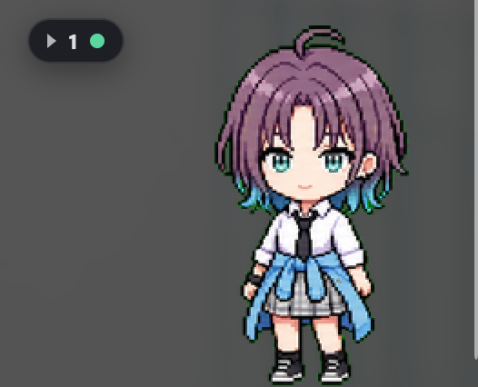

<div align="center">

# 🐾 AI Pet

### One desktop companion for all your AI terminal agents

A transparent, draggable desktop pet that reflects what your AI CLIs are doing —
Codex, Claude Code, Antigravity, Aider, or any command — through one shared
runtime with client adapters.

<!-- HERO SCREENSHOT: drop a wide shot at docs/screenshots/hero.png
     (the pet on the desktop with a couple of session bubbles) -->


</div>

---

## What is this?

Most "desktop pet for an AI tool" projects build one pet per tool. AI Pet does
the opposite: it is **one AI Terminal Pet Runtime** that many AI clients plug
into through adapters.

You might be running several agents at once:

```text
Codex CLI       → backend repo
Claude Code     → frontend repo
Antigravity CLI → infra repo
Aider           → docs repo
```

AI Pet watches all of them and presents one ambient interface:

- **One global pet** — reflects the selected or most urgent AI session; clickable,
  draggable, and position-persistent like a real desktop companion.
- **Session bubbles** — one compact bubble per active session showing client,
  project, the latest activity, and a status icon (a spinning *working* circle, a
  green *done* check, a yellow *needs you*, or a red *failed* cross). A folder
  button beside the pet folds them away.

## Features

- 🪟 **Transparent, frameless, always-on-top overlay** that doesn't steal focus and
  stays click-through outside the pet and bubbles.
- 🖱️ **Click / double-click / drag** — click folds/unfolds the bubbles, double-click
  expands them, drag moves the pet (position persists; bubbles stay on-screen).
- 🟢 **Live session bubbles** with per-session status icons and a folder toggle.
- 🧠 **Normalized state model** — every client maps to a shared state vocabulary
  (`thinking`, `running_tool`, `waiting_approval`, `reviewing`, `failed`, …).
- 🧩 **Client adapters** with tiered support (process wrapper → PTY observer →
  log/state → official plugin) so the daemon never bakes in client-specific logic.
- 🚀 **Zero-setup launch** — `ai-pet run …` auto-starts the overlay; no separate
  daemon to manage.
- 🖼️ **Codex-compatible pet assets** (1536×1872 sprite atlas, 9 actions).
- 🔒 **Local-only & private** — no prompts, files, or screenshots leave your machine.
- 🪟🍎🐧 **Cross-platform** core with per-OS adapters for IPC and windowing.

## Screenshots

<!-- Drop each PNG into docs/screenshots/ with the filename shown (~800px wide).
     Delete any row you don't have a shot for. -->

| | |
|---|---|
| **The global pet** — reacting to the highest-priority session.<br> | **Session bubbles** — one per active session, with status icons.<br> |
| **Folder collapsed** — bubbles tucked away beside the pet.<br> | **Tray menu** — show/hide, pets, reset position, Quit.<br> |

## Documentation

| Doc | What's in it |
|---|---|
| **This README** | Install + users' guide |
| [docs/architecture.md](docs/architecture.md) | How it works, components, project structure, adapter tiers, platform matrix, native helpers, roadmap |
| [docs/publishing.md](docs/publishing.md) | Releasing to npm (the tag → publish workflow) |
| [docs/troubleshooting.md](docs/troubleshooting.md) | Common fixes, incl. repairing a broken Electron install |
| [docs/known-issues.md](docs/known-issues.md) | Deferred issues with known root causes |
| [docs/cross-os-qa.md](docs/cross-os-qa.md) | Cross-OS test matrix |
| [apps/companion/README.md](apps/companion/README.md) | Companion (Electron) internals |
| [PROGRESS.md](PROGRESS.md) | Detailed development log |

---

# Users' Guide

## Requirements

| Requirement | Why |
|---|---|
| **Node ≥ 18** | Runtime + companion (Electron) |
| **npm** | Install + scripts |

> Live activity status uses the optional `node-pty` (installed automatically when
> it can build; the pet degrades to lifecycle-only tracking without it).

## Install

**From npm** *(once published — recommended for users):*

```bash
npm install -g ai-pet     # exposes the `ai-pet` command globally
```

**From source** *(current):*

```bash
git clone <repo-url> haya-pet
cd haya-pet
npm install
npm link                  # makes `ai-pet` available everywhere
```

Prefer not to link globally? Call it directly anywhere you'd type `ai-pet`:
`node <repo>/apps/cli/src/ai-pet.js`.

## Run an AI session

Just wrap any command. **The first `ai-pet run` auto-starts the pet overlay** —
there's nothing to launch first:

```bash
ai-pet run --client codex        -- codex
ai-pet run --client claude-code  -- claude
ai-pet run --client generic      -- aider
# Windows / PowerShell example:
ai-pet run --client generic      -- powershell -Command "Start-Sleep 10"
```

A **session bubble** appears while the command runs (client · project · status),
and the pet reflects the highest-priority session. On exit the bubble briefly
shows success (a green check) or failure (a red cross), then fades.

> If the overlay can't be started (e.g. Electron is missing), your command still
> runs normally and keeps its exit code — you just won't see the pet. Disable
> auto-start with `AI_PET_NO_AUTOSTART=1`, or launch it yourself with `ai-pet start`.

### Live activity status

By default the wrapper runs the CLI through a pseudo-terminal and shows *working*
while the AI produces output, returning to *idle* after a short quiet window.
Success/failure come from the real exit code — never from scraping the word
"error" out of output. Your terminal stays fully interactive.

```bash
ai-pet run -- claude          # live status (default)
ai-pet run --no-observe -- claude   # lifecycle only (opt out of PTY observation)
```

> ⚠️ Running a CLI through the default PTY observation currently affects terminal
> scrolling and backspace in some setups — see
> [docs/known-issues.md](docs/known-issues.md). `--no-observe` avoids it.

## Add and choose a pet

A pet is a folder with `pet.json` and a 1536×1872 sprite atlas (8×9 cells of
192×208). Drop it into a search path:

```text
~/.codex/pets/my-pet/                     (Windows: %USERPROFILE%\.codex\pets\my-pet\)
    pet.json          { "id": "my-pet", "name": "My Pet", "spritesheet": "spritesheet.webp" }
    spritesheet.webp
```

Pets are discovered from `~/.codex/pets` and `~/.ai-pet/pets`. Then choose one:

```bash
ai-pet pets               # list installed pets (* = selected)
ai-pet pets use my-pet    # select; remembered on every launch
```

Your choice is stored and reused every time. You can also pick from the tray menu
→ **Installed Pets**. Without a spritesheet, the pet renders labelled placeholder
frames so everything still works.

## Interact with the pet

| Action | Result |
|---|---|
| Single click | waves + folds/unfolds the session bubbles |
| Double click | jumps + expands the bubbles |
| Drag | moves the pet; position is saved (bubbles follow, always on-screen) |
| Tray icon → menu | show/hide, display mode, sessions, pets, **reset position**, **Quit** |

## Stop / exit the pet

```bash
ai-pet stop      # ask the running overlay to quit
```

…or **right-click the tray icon → Quit**. `ai-pet stop` is a no-op if nothing is
running, so it's always safe to call.

## Manage the overlay

```bash
ai-pet start     # start the overlay explicitly (usually unnecessary — run auto-starts it)
ai-pet stop      # quit it
```

## Troubleshooting

Common fixes:

| Symptom | Fix |
|---|---|
| `ai-pet: command not found` | Install globally, or `npm link` in a source checkout. |
| Pet doesn't react to a session | Launch via `ai-pet run …`; check `AI_PET_NO_AUTOSTART` isn't set. |
| Pet shows a blue placeholder box | No spritesheet — add a pet (above). |
| Pet is off-screen | Tray menu → **Reset Position**. |
| Can't exit | `ai-pet stop` or tray → **Quit**. |

Full list (incl. repairing a broken Electron install): [docs/troubleshooting.md](docs/troubleshooting.md).

---

## Supported clients

| Client | Status | Support level |
|---|---|---|
| Generic CLI | ✅ | L1 process wrapper |
| Codex | ✅ | L1 + L2 PTY observation |
| Claude Code | ✅ | L1 + L2 PTY observation |
| Antigravity | ✅ | L1 wrapper |
| Gemini CLI / Aider / others | 🔜 | via the generic adapter |

(See [docs/architecture.md](docs/architecture.md) for the support tiers and the
platform matrix.)

## Privacy

AI Pet is local-only by default. It does **not** upload prompts, files,
screenshots, or session logs; it stores only short derived status summaries.
Approvals always require explicit user action.

## Contributing & tests

```bash
npm test     # runs the full suite (TDD; tests live in **/test/*.test.mjs)
```

See [docs/architecture.md](docs/architecture.md) to find your way around the code.

## License

See [`LICENSE`](LICENSE).
