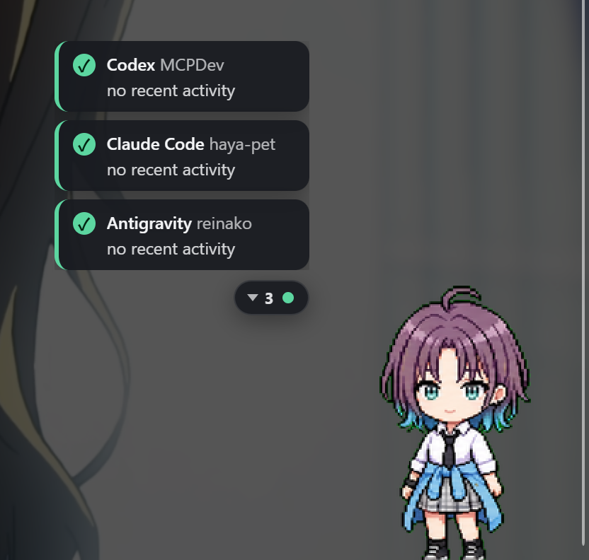
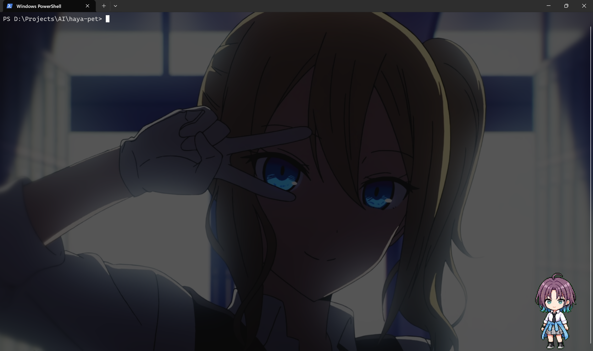
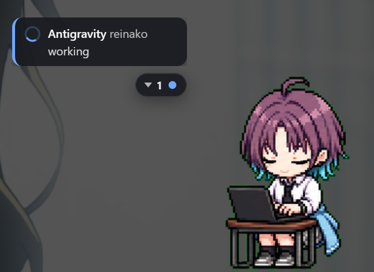
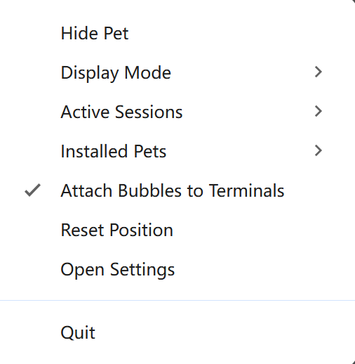

<div align="center">

# 🐾 AI Pet

### One desktop companion for all your AI terminal agents

A transparent, draggable desktop pet that reflects what your AI CLIs are doing —
Codex, Claude Code, Antigravity, Aider, or any command — through one shared
runtime with client adapters.

<!-- ─────────────────────────────────────────────────────────────
     HERO SCREENSHOT
     Drop a wide hero shot at docs/screenshots/hero.png
     (the pet sitting on the desktop with a couple of session bubbles)
     ───────────────────────────────────────────────────────────── -->



</div>

---

## What is this?

Most "desktop pet for an AI tool" projects build one pet per tool. AI Pet does
the opposite: it is **one AI Terminal Pet Runtime** that many AI clients plug
into through adapters.

You might be running several agents at once:

```text
Codex CLI       → backend repo
Claude Code     → frontend repo
Antigravity CLI → infra repo
Aider           → docs repo
```

AI Pet observes all of them and presents one coherent ambient interface:

- **One global pet** — reflects the selected or most urgent AI session, and is
  clickable, draggable, and position-persistent like a real desktop companion.
- **Session bubbles** — one compact bubble per active session showing client,
  project, status, and a short summary.
- **A task talk window** — a focused control surface to read the latest update,
  reply, and approve/deny actions for the selected session.

## Features

- 🪟 **Transparent, frameless, always-on-top overlay** that does not steal focus
  and stays click-through outside the pet's hitbox.
- 🖱️ **Click / double-click / drag** interactions — single click waves, double
  click jumps, drag moves the pet and persists its position.
- 🧠 **Normalized state model** — every client maps to a shared state vocabulary
  (`thinking`, `running_tool`, `waiting_approval`, `reviewing`, `failed`, …)
  that drives the pet animation.
- 🧩 **Client adapters** with tiered support (process wrapper → PTY observer →
  log/state → official plugin) so the daemon never bakes in client-specific logic.
- 💬 **Task talk window** with status pills, reply composer, and approval
  controls — gated by what each adapter can *safely* do.
- 🖼️ **Codex-compatible pet assets** (1536×1872 sprite atlas, 9 actions).
- 🔒 **Local-only & private** — no prompts, files, or screenshots ever leave your
  machine.
- 🪟🍎🐧 **Cross-platform** core with per-OS adapters for IPC, windowing, and
  terminal attachment.

## Screenshots

<!-- ─────────────────────────────────────────────────────────────
     Drop each PNG into docs/screenshots/ with the filename shown.
     Suggested width ~800px. Delete any row you don't have a shot for.
     ───────────────────────────────────────────────────────────── -->

### The global pet

> The pet overlay reacting to the highest-priority session.



### Session bubbles

> One compact bubble per active AI session.



### Task talk window

> Status, latest activity, reply box, and approval controls for the selected session.


### Tray menu

> Recovery controls — show/hide, display mode, sessions, pets, reset position.



## How it works

```text
AI terminal clients
    → client adapters        (normalize behavior into a common event model)
    → ai-petd daemon         (sessions, priority, pet state, IPC)
    → shared pet runtime     (assets, animation, interaction)
    → desktop overlay        (global pet + session bubbles + task talk window)
```

You launch any AI CLI through the wrapper, which registers a session and reports
lifecycle events to the daemon:

```bash
ai-pet run --client codex        -- codex
ai-pet run --client claude-code  -- claude
ai-pet run --client generic      -- aider
```

| Component | Responsibility |
|---|---|
| `ai-petd` (companion) | Global daemon: owns sessions, pet state, windows, IPC. |
| `ai-pet` (CLI) | Wrapper: launches clients, registers sessions, reports events. |
| adapters | Translate client-specific behavior into the common state model. |
| pet-core | Loads pet assets, computes frames, drives animation state. |
| session-core | Tracks sessions, priority, summaries, bubble view models. |
| task-core | Task status, events, approvals, replies, control gating. |
| platform-core | Per-OS paths, capabilities, and fallback tiers. |

## Project structure

```text
packages/
  protocol/        IPC message types + validation
  pet-core/        atlas, manifest, validation, animator, animation-state
  session-core/    registry, priority, summaries, bubble views
  task-core/       task status, events, store, approvals, replies, controls
  adapters/        client info, heuristics, capabilities, output observer, routing
  daemon-core/     IPC server/transport, runtime bridge, singleton
  platform-core/   platform, paths, capabilities
apps/
  cli/             ai-pet run entrypoint + parser
  companion/       Electron overlay app (main + renderer)
  pet-preview/     static preview scaffold
native/
  win-window-helper/   Windows terminal-window helper (.NET, implemented)
  mac-window-helper/   macOS helper (contract documented)
  linux-window-helper/ Linux X11/Wayland helper (contract documented)
assets/
  fallback-pet/    bundled fallback pet manifest
```

## Quick Start

A full setup-and-use guide. Commands are shown for **Windows / PowerShell**
first (this is the primary dev platform); macOS/Linux equivalents are noted
where they differ.

### 0. Prerequisites

| Requirement | Why | Check |
|---|---|---|
| **Node ≥ 18** | Core + companion (Electron) | `node --version` |
| **npm** | Install + scripts | `npm --version` |
| **.NET SDK 10** | *Optional* — only to build the Windows terminal helper (`net10.0-windows`) | `dotnet --version` |

> The core runtime has **no external npm dependencies**. Only the companion app
> pulls in Electron (installed inside the app, not the root).

### 1. Get the code and verify the core

```powershell
git clone <your-fork-or-repo-url> haya-pet
cd haya-pet
npm test            # expect: 172/172 tests passed
```

If the tests pass, the runtime logic is healthy before you touch any UI.

### 2. Make the `ai-pet` wrapper command available

The CLI is declared as a bin in the root `package.json`. Register it once:

```powershell
npm link            # now `ai-pet` works from any terminal
```

Prefer not to link globally? Call it directly instead — anywhere you see
`ai-pet`, substitute:

```powershell
node D:\path\to\haya-pet\apps\cli\src\ai-pet.js
```

### 3. Launch the companion overlay (this is also the daemon)

The Electron companion renders the pet **and** hosts the IPC server that wrappers
talk to. Starting it starts everything — there is no separate daemon process yet.

```powershell
cd apps\companion
npm install         # installs Electron (≥ 28) into the app
npm start           # electron .
```

A transparent pet appears (bottom-right by default). Leave this window running.

> **No spritesheet?** The pet renders labelled placeholder frames (a blue box
> showing the current action) so everything still works. Add a real pet in step 4.

### 4. (Optional) Add and choose a pet

Drop a Codex-compatible pet folder into a search path:

```text
%USERPROFILE%\.codex\pets\my-pet\      (macOS/Linux: ~/.codex/pets/my-pet/)
    pet.json          { "id": "my-pet", "name": "My Pet", "spritesheet": "spritesheet.webp" }
    spritesheet.webp  1536×1872 atlas (8×9 cells of 192×208)
```

Then pick it (the choice is stored and reused on every launch):

```powershell
ai-pet pets              # list installed pets (* = selected)
ai-pet pets use my-pet   # select; applied on the companion's next start
```

You can also pick from the tray menu → **Installed Pets**.

### 5. Track an AI session

With the companion running, open **another** terminal and wrap any command:

```powershell
ai-pet run --client generic      -- powershell -Command "Start-Sleep 10"
ai-pet run --client codex        -- codex
ai-pet run --client claude-code  -- claude
```

macOS/Linux example:

```bash
ai-pet run --client generic -- sleep 10
```

While the command runs, a **session bubble** appears (client · project · status)
and the pet reflects the highest-priority session. On exit the pet shows success
(jump) or failure.

#### Live activity status (default)

The wrapper runs the CLI through a pseudo-terminal and reflects activity from its
output — **on by default**. It is **activity-based**: while the AI is producing
output the pet shows *working* (running), and after a short quiet window it
returns to *idle*. Success/failure come from the real exit code (a one-shot
reaction), never from scraping the word "error" out of the output.

```powershell
ai-pet run --client claude-code -- claude   # live status, no extra flag
ai-pet run --no-observe -- claude           # opt out: lifecycle only
```

It uses the optional `node-pty` dependency (installed automatically when
available) and never downgrades your terminal — the CLI keeps its full
interactive TTY. If `node-pty` isn't installed, it transparently falls back to
plain lifecycle tracking. Keyword heuristics (detecting specific states like
"waiting for approval" from output text) are available but opt-in, since
substring matching is unreliable on rich TUIs.

> **Order matters:** start the companion first. If it isn't running, your wrapped
> command still runs normally and keeps its exit code — the pet just won't
> reflect it.

### 6. Interact with the pet

| Action | Result |
|---|---|
| Single click | waves |
| Double click | jumps + opens the task talk window |
| Drag | moves the pet; position is saved |
| Click a session bubble | selects it + opens the talk window |
| Tray icon → menu | show/hide, display mode, sessions, pets, **reset position** |

The **tray menu** is your recovery tool if the pet goes off-screen or hidden.

### 7. (Optional, Windows) Build the terminal-window helper

For attaching bubbles near terminal windows on Windows:

```powershell
cd native\win-window-helper
dotnet build -c Release
# -> bin/Release/net10.0-windows/ai-pet-win-window-helper.exe
```

### Troubleshooting

| Symptom | Fix |
|---|---|
| `ai-pet: command not found` | Run `npm link` in the repo root (step 2), or call the file directly. |
| Pet doesn't react to a session | Make sure the companion is running, and that you launched the command via `ai-pet run …`. |
| Pet shows a blue placeholder box | No spritesheet found — add one (step 4); behaviour is otherwise correct. |
| Pet is off-screen | Tray menu → **Reset Position**. |
| `ai-pet pets` shows "No pets found" | Add a pet folder with **both** `pet.json` and a spritesheet to a search path. |
| `npm start` → `ENOENT … electron\path.txt` | Electron's postinstall extraction was interrupted/corrupted. See "Fixing a broken Electron install" below. |

#### Fixing a broken Electron install

If `npm start` fails with `ENOENT … node_modules\electron\path.txt`, the Electron
binary download succeeded but extraction left `dist/` empty. The cached zip is
fine, so re-extract it without re-downloading (PowerShell):

```powershell
$cache = Get-ChildItem "$env:LOCALAPPDATA\electron\Cache" -Recurse -Filter "electron-*.zip" |
         Sort-Object LastWriteTime -Descending | Select-Object -First 1
$dist  = "node_modules\electron\dist"          # run from the repo root
Remove-Item -Recurse -Force $dist -ErrorAction SilentlyContinue
New-Item -ItemType Directory $dist | Out-Null
Expand-Archive -Path $cache.FullName -DestinationPath $dist -Force
Set-Content "node_modules\electron\path.txt" "electron.exe" -NoNewline
node_modules\.bin\electron --version            # should print the version
```

If `electron.exe` is missing even after a clean `Expand-Archive`, your antivirus
likely quarantined it — allow `node_modules\electron\dist\electron.exe` and retry.

See [`apps/companion/README.md`](apps/companion/README.md) for companion internals
and [`docs/cross-os-qa.md`](docs/cross-os-qa.md) for the cross-OS test matrix.

## Supported clients

| Client | Status | Support level |
|---|---|---|
| Generic CLI | ✅ | L1 process wrapper |
| Codex | ✅ | L1 + L2 PTY heuristics |
| Claude Code | ✅ | L1 + L2 PTY heuristics |
| Antigravity | ✅ | L1 wrapper |
| Gemini CLI / Aider / others | 🔜 | via generic adapter |

## Platform support

| Feature | Windows | macOS | Linux X11 | Linux Wayland |
|---|---|---|---|---|
| Protocol / session core | ✅ | ✅ | ✅ | ✅ |
| Generic CLI wrapper | ✅ | ✅ | ✅ | ✅ |
| Local daemon IPC | named pipe | unix socket | unix socket | unix socket |
| Transparent overlay | ✅ | ✅ | ✅ | best-effort |
| Terminal attachment | ✅ helper | 🔜 | 🔜 | fallback |

See [`docs/cross-os-qa.md`](docs/cross-os-qa.md) for the full matrix.

## Pets

Pets are discovered from `~/.codex/pets` and `~/.ai-pet/pets` (on Windows:
`%USERPROFILE%\.codex\pets` and `%LOCALAPPDATA%\ai-pet\pets`). A pet is a folder
with `pet.json` and a 1536×1872 sprite atlas (8×9 cells of 192×208, 9 actions):

```text
~/.codex/pets/
  my-pet/
    pet.json            { "id": "my-pet", "name": "My Pet", "spritesheet": "spritesheet.webp" }
    spritesheet.webp
```

Without a spritesheet, the renderer draws labelled placeholder frames so
interaction and state mapping still work. See
[`assets/fallback-pet/README.md`](assets/fallback-pet/README.md).

### Choosing a pet

List installed pets and select one from the command line:

```bash
ai-pet pets              # list discovered pets (* marks the selected one)
ai-pet pets use my-pet   # select a pet
```

Your choice is stored in the state file (`globalPet.selectedPetId`), so the
companion **starts with your last selected pet** every time. You can also pick a
pet from the tray menu → **Installed Pets**. (A running companion picks up a CLI
change on its next start.)

## Privacy

AI Pet is local-only by default. It does **not** upload prompts, files,
screenshots, or session logs; it stores only short derived status summaries.
The reply button never blindly types into a terminal — wrapper-only clients show
"Open terminal to reply" instead. Approvals always require explicit user action.

## Status & roadmap

The shared core, CLI wrapper, daemon IPC, adapters, task talk core, Electron
shell, the Windows terminal helper, and PTY-based live activity observation
(`--observe`) are implemented and tested. In progress:

- Bidirectional IPC so the daemon routes replies/approvals back to the wrapper.
- macOS (Swift/AppKit) and Linux X11 (Xlib) terminal helpers.
- A larger mouse-pass-through overlay window so bubbles / the task talk window
  sit beside the pet instead of on top of it.
- Production overlay/IPC validation across all platforms.

See [`PROGRESS.md`](PROGRESS.md) for the detailed log.

## Testing

```bash
npm test     # 159 tests across the core packages and apps
```

Tests are written first (TDD) and live next to each module in `**/test/*.test.mjs`.

## License

See [`LICENSE`](LICENSE).
